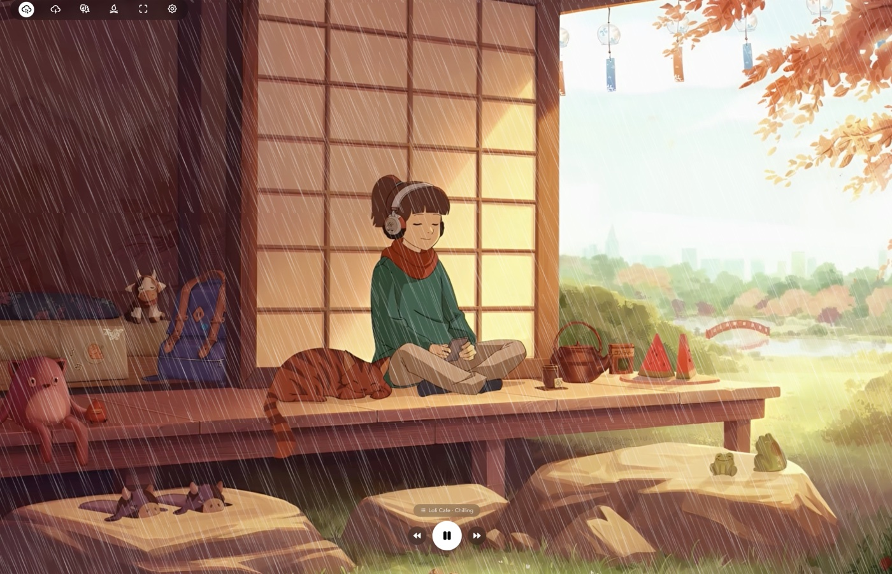
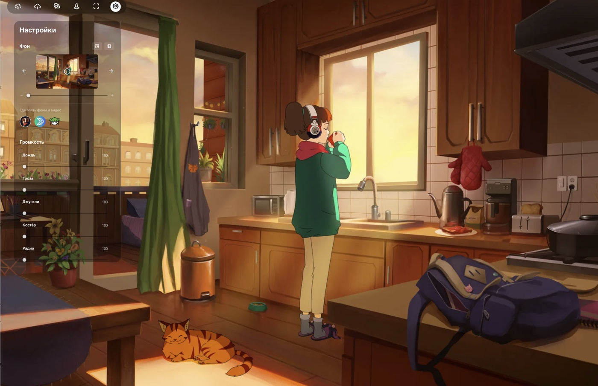
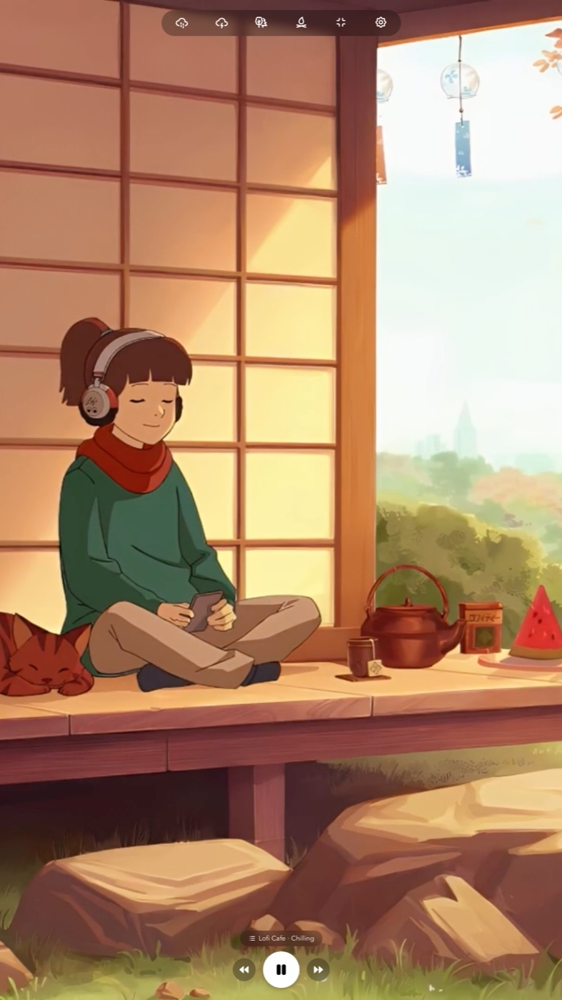

<p align="center"></p>

<h1 align="center">LoFiTyan</h1>

<p align="center">
  <b>Your cozy LoFi-chan, right on your desktop.</b><br/>
  Real lo-fi internet radio + ambient atmosphere for work, study and evening chill — in a calm little window with a character.
</p>

<p align="center">
  <a href="https://github.com/Victory-SergD/SergD_LoFiTyan/releases/latest"></a>
  <a href="https://github.com/Victory-SergD/SergD_LoFiTyan/releases"></a>
  
  <a href="LICENSE"></a>
  <a href="https://github.com/Victory-SergD/SergD_LoFiTyan/stargazers"></a>
</p>

<p align="center">
  <a href="https://github.com/Victory-SergD/SergD_LoFiTyan/releases/latest"><b>⬇️ Download — macOS · Windows · Linux</b></a> &nbsp;·&nbsp; <a href="README.md">🇷🇺 Русский</a>
</p>

<p align="center"><sub>A free, open-source alternative to Wallpaper Engine · Lofi.co · Noisli.</sub></p>

<p align="center"></p>

<p align="center">
  
  &nbsp;&nbsp;
  
</p>

> 🛠️ A **Victory** project. Built on the open-source [lofi-engine](https://github.com/meel-hd/lofi-engine) (MIT) — turned into a player for **real lo-fi radio** with ambience, a character background and a portrait mode.

**Author:** SergD · GitHub [@Victory-SergD](https://github.com/Victory-SergD)

## 📖 What is it

**LoFiTyan** is a lightweight desktop app (built with Tauri) that plays **real lo-fi music from internet radio** ([radio-browser.info](https://www.radio-browser.info), lofi/chillhop stations) over a cozy scene — **an image or your own video** (live wallpaper, with zoom and frame point for any monitor). On top of the music you can layer **ambient sounds** (rain, thunder, forest, campfire — seamless loop), and the controls **auto-hide** while you're idle, leaving a clean live wallpaper. Runs on **macOS, Windows and Linux**.

> Music streams from internet radio (needs a connection); ambience, background and UI are local.

> A free, open-source alternative to **Wallpaper Engine** + **Lofi.co** + **Noisli** — for studying, coding, editing, or just unwinding.

## ✨ Features

- 🎵 **Real lo-fi radio**: stations from radio-browser.info, play/pause, ◀ ▶ skip; resilient loading (mirror fallback, tap-to-retry on error).
- 🎛️ **Station picker**: genres (Lo-Fi / Chillhop / Focus / Sleep), a curated set of HQ stations with bitrate badges, favorites ★, a "More" tab (radio-browser), remembers your last station.
- ⏳ **Clear feedback**: spinner while loading/buffering, a message on network errors.
- 🎬 **Live video wallpapers**: bring your own video via the native dialog; **zoom slider** + **click-to-set frame point** keep the subject framed in landscape and portrait, no empty bars. Image scenes support the same zoom/focus.
- 🌧️ **Ambience over the music**: rain, thunder, forest, campfire — **seamless loop** (Web Audio, no click at the seam), with a rain visual.
- 🔊 **Master volume** for radio and effects; stop-all with the `k` key.
- 🖥️ **True full-screen** (edge-to-edge): ⛶ button in the dock, exit with `Esc`.
- ⌨️ **Honest hotkeys**: `Space` play/pause, `K` stop-all, `A/S/D/F` effects, `←/→` background, `J` settings, `Ctrl/Cmd+I` immersive mode.
- 🌌 **Immersive mode**: controls hide while idle and return **instantly** on movement — the first click lands.
- 🌍 **7 interface languages** (defaults to your OS language).

## ⬇️ Install

> Ready-to-use installers for **macOS** (Apple Silicon / Intel), **Windows** and **Linux** — all on the [**Releases**](https://github.com/Victory-SergD/SergD_LoFiTyan/releases/latest) page.

> [!IMPORTANT]
> ### 🍎 macOS: run ONE command after installing — otherwise the app won't open!
> The app isn't signed with an Apple certificate (true for most open-source apps), so macOS blocks it. Drag **LoFiTyan** to Applications, open **Terminal** and run:
> ```bash
> /usr/bin/xattr -cr /Applications/LoFiTyan.app
> ```
> After that LoFiTyan opens normally with a double-click. *(A no-Terminal way: System Settings → Privacy & Security → "Open Anyway".)*

#### 🍎 macOS

1. Download `LoFiTyan_*_aarch64.dmg` (Apple Silicon, M1–M4) or `LoFiTyan_*_x64.dmg` (Intel) from [**Releases**](https://github.com/Victory-SergD/SergD_LoFiTyan/releases/latest).
2. Open the `.dmg` and drag **LoFiTyan** to **Applications**.
3. Clear the quarantine once (see the box above): `/usr/bin/xattr -cr /Applications/LoFiTyan.app`.

#### 🪟 Windows

1. Download `LoFiTyan_*_x64-setup.exe` (or the `.msi`) from [Releases](https://github.com/Victory-SergD/SergD_LoFiTyan/releases/latest) and run it.
2. The build is unsigned, so SmartScreen may warn you → **More info → Run anyway**.

#### 🐧 Linux

```bash
# AppImage (universal)
chmod +x LoFiTyan_*.AppImage && ./LoFiTyan_*.AppImage

# Debian / Ubuntu
sudo apt install ./LoFiTyan_*.deb

# Fedora / RHEL
sudo rpm -i LoFiTyan_*.rpm
```

### 🎬 Live video wallpapers (optional)

<p align="center"></p>
<p align="center"><sub>↑ The bundled default live wallpaper (LoFi-chan, autumn).</sub></p>

By default the background is an image scene. To set a **live video**:

1. Download the sample `lofi-girl-autumn.mp4` from [Releases](https://github.com/Victory-SergD/SergD_LoFiTyan/releases/latest) — or use any video/loop of your own.
2. In the app: **⚙ Settings → Background → Video → choose file** and pick the video.
3. **Click the preview** to set the frame point and drag the **zoom slider** — settings are saved per background and survive a monitor-orientation change.

## 🧩 Tech stack

`Tauri 2` · `Svelte` · `TypeScript` · `Vite` · `radio-browser.info API` · `pnpm` · `Vitest`

## 🚀 Run locally

You'll need: [Node.js](https://nodejs.org/), [pnpm](https://pnpm.io/), [Rust](https://www.rust-lang.org/) (stable) and the [Tauri prerequisites](https://tauri.app/start/prerequisites/) for your OS.

```bash
git clone https://github.com/Victory-SergD/SergD_LoFiTyan
cd SergD_LoFiTyan
pnpm install
pnpm tauri:d   # run from source (dev mode)
pnpm tauri:b   # build an installer (.dmg / .exe / .deb / ...)
```

Also: `pnpm dev` (frontend only), `pnpm test` (unit tests, Vitest), `pnpm check` (type check), `pnpm build`.

## 🙏 Based on

This project is a fork of [**meel-hd/lofi-engine**](https://github.com/meel-hd/lofi-engine) (MIT). Huge thanks to the author and contributors for the great foundation. The radio integration is inspired by MIT projects around [radio-browser.info](https://www.radio-browser.info) (request pattern, no fork).

## 📄 License

[MIT](LICENSE) — like the original. Free to use, modify and share. If you like it, **[⭐ star the repo](https://github.com/Victory-SergD/SergD_LoFiTyan)** — it genuinely helps discovery.
